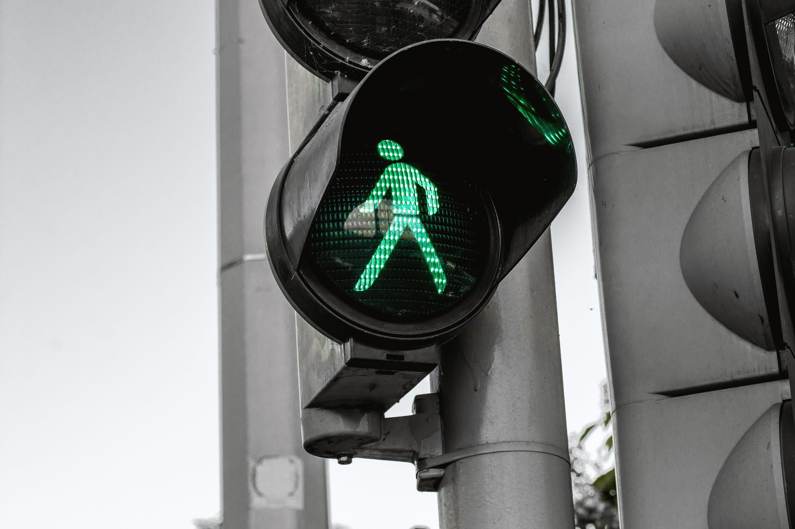

Photo by JESHOOTS.com on [Pexels.com](https://www.pexels.com/photo/automatic-city-control-crossing-442584/)

Jakiś czas temu [pisałem](http://strefapiesza.blox.pl/2011/05/W-2009-roku-prowadzono-kampanie-na-rzecz-poprawy.html%20), że w polskich kampaniach społecznych dotyczących bezpieczeństwa ruchu drogowego dzieci traktujemy jak dorosłych, a dorosłych jak dzieci. Po obejrzeniu opisanego spotu można było wysnuć wniosek, że ruch drogowy jest żywiołem nie do opanowania przez władze i specjalistów od bezpieczeństwa ruchu drogowego, zatem to przede wszystkim piesi - mali, duzi, niedowidzący, niepełnosprawni - muszą **ZAWSZE** **UWAŻAĆ.**

Myślałem jednak wtedy, że to tylko nieprzemyślany, niefortunnie skonstruowany filmik. Dziś okazało się, że to rzeczywistość. W dodatku z zupełnie zaskakującą mnie kontynuacją.

[Oto krótka historia](http://wiadomosci.gazeta.pl/wiadomosci/1,114871,13113288,Demoralizacja_wedlug_policji__Przebieganie_przez_przejscie.html): dziewczynka wracała do domu, dotarła do przejścia dla pieszych, na którym zaczęło migać zielone, więc wbiegła na pasy. Niestety po 2,5 metra została potrącona - kierująca skręcała na zielonej strzałce. "kobieta nie wezwała policji ani pogotowia, tylko wsadziła gimnazjalistkę do swojego auta i zawiozła do prywatnej przychodni. Dopiero stamtąd pojechały do szpitala i powiadomiły o wypadku mamę Patrycji, a następnie policję. Na szczęście dziewczynce - oprócz ogólnych potłuczeń - nic poważnego się nie stało."

Można byłoby powiedzieć - historia z happy endem.

Nic z tych rzeczy, czytamy dalej, że "_Policja powołała biegłego, który wydał opinię, że zachowanie 14-latki "pozostawało w rażącej sprzeczności z zasadami bezpieczeństwa drogowego. Nieprawidłowość jej zachowania polegała na niezachowaniu szczególnej ostrożności przed wkroczeniem na jezdnię". Uznał, że kierująca fiatem nie miała możliwości wyhamowania, bo dziewczynka jej wyskoczyła przed maskę. Kwestią tego, że nie wezwała służb ratunkowych i odjechała z miejsca zdarzenia, nikt się nie zajął._

_Kilka dni przed Bożym Narodzeniem mama 14-letniej Patrycji dostała pismo z sądu, w którym przeczytała, że w wydziale rodzinnym i nieletnich Sądu Rejonowego w Gliwicach wszczęto postępowanie dotyczące jej córki. "Z materiałów nadesłanych przez Komendę Miejską Policji wynika, iż istnieje uzasadnione przypuszczenie, iż nieletnia wykazuje przejawy demoralizacji" - napisali sędziowie. "_

_Na początku stycznia w szkole Patrycji pojawi się jednak kurator, który zrobi wywiad środowiskowy na jej temat. O jej "prowadzenie się" będzie też wypytywał sąsiadów oraz znajomych z podwórka. Potem wyda opinię, od której będzie zależał dalszy los 14-latki. W najgorszym wypadku może nawet trafić do ośrodka wychowawczego._ 

_Policja:  W tej sytuacji, kiedy nastolatka została określona jako sprawca wypadku, nie mieliśmy wyjścia i musieliśmy skierować wniosek do sądu do spraw nieletnich. Określenie "demoralizacja" może jest niefortunne, ale musimy trzymać się przepisów - wyjaśnia nadkomisarz Marek Słomski, rzecznik komendy miejskiej w Gliwicach._"

Skoro mamy trzymać się przepisów, oto odpowiedni fragment rozporządzenia o sygnałach i znakach (wytłuszczenia moje):

> _§ 98. 2. Sygnały świetlne dla pieszych nadawane przez sygnalizator S-5 oznaczają:_  
> _1) sygnał zielony - **zezwolenie na wejście na przejście** dla pieszych, przy czym sygnał zielony migający oznacza,_ _że za chwilę zapali się sygnał czerwony i pieszy jest obowiązany **jak najszybciej** opuścić przejście,_

Jak widać migające zielone światło dla pieszych to wciąż jest zielone światło dla pieszych. Dodam, że nawet z zachętą do przebiegania - w końcu dodano "jak najszybciej". Podsumowując - dziewczynka nie złamała przepisów.

Za to przepis dotyczący kierowców jest taki:

> _§ 96. 1. Nadawany przez sygnalizator S-2 sygnał czerwony wraz z sygnałem w kształcie zielonej strzałki_ _oznacza, że dozwolone jest skręcanie w kierunku wskazanym strzałką w najbliższą jezdnię na skrzyżowaniu,_ _z zastrzeżeniem ust. 3._
> 
> _3\. Skręcanie lub zawracanie, o których mowa w ust. 1 i 2, jest dozwolone pod warunkiem, że **kierujący**_ _**zatrzyma się przed sygnalizatorem i nie spowoduje utrudnienia ruchu innym jego uczestnikom.**_

Kierująca nie zatrzymała się i - mówiąc bardzo delikatnie - spowodowała utrudnienie ruchu pieszej. Zwlekała z wezwaniem policji. Podsumowując: złamała przepisy.

Mimo jasnej sytuacji i wystarczająco jasnych przepisów, mamy dwukrotnie pokrzywdzone dziecko - raz przez kierowcę, a drugi raz przez system, który nie tylko uznał ją winną, ale stosuje dodatkowe szykany wysyłając kuratora na wywiad środowiskowy.

Widać też jakie szkody mentalne uczynił policji, biegłemu i sądowi przepis o zakazie wchodzenia bezpośrednio przed nadjeżdżający pojazd. Najwyższa pora usunąć ten relikt z Prawa o Ruchu Drogowym i przeszkolić ludzi. Bez tego trudno wyobrazić sobie poprawę bezpieczeństwa pieszych na naszych drogach.
